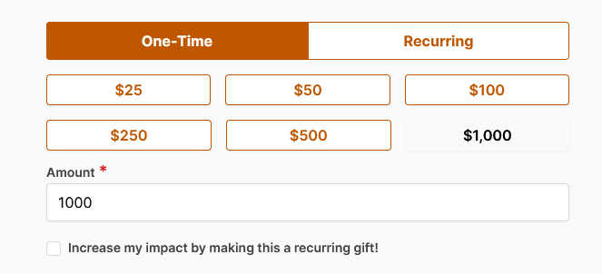

# Donate to DPMP!

We have now completed the final stage of our project: fully renewed public interface! If you have a dataset ready for release, we are happy to help you publish it—especially since all publication fees are waived until August 2026 through generous support from the National Science Foundation (NSF) and the Digital Porous Media Industry Affiliate Program at UT Austin. 

Although publication is free, we sincerely appreciate donations that help us continue improving and maintaining the Digital Porous Media Portal. 

**Because we operate under the broader [UT Giving](https://giving.utexas.edu/what-starts-here/?utm_source=giving+homepage) system, it is important to follow the donation guidelines carefully to ensure your contribution is directed specifically to the Digital Porous Media Portal. Please follow the steps below to donate correctly:**

1. Go to the [UT Giving](https://giving.utexas.edu/what-starts-here/?utm_source=giving+homepage) webpage and select `GIVE NOW.`
    
2. On the next page, choose your donation amount and whether it is recurring or one-time, then scroll down.
    
3. Under the `Designation` dropdown, either type `Digital Porous Media Portal` (case insensitive) until the option appears under `Cockrell School of Engineering`, or manually scroll to Cockrell School of Engineering and select Digital Porous Media Portal.
    
4. Once correctly selected, the designation field should appear as shown in the example image.
    
5. Complete the rest of the form and submit.

Thank you for supporting our community and helping sustain open-access porous media databases. 