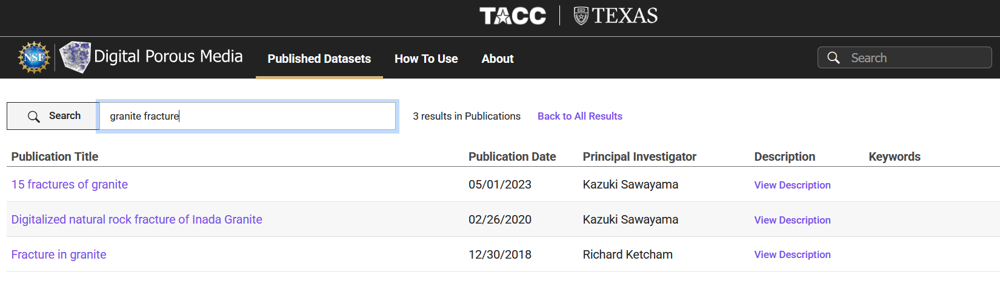
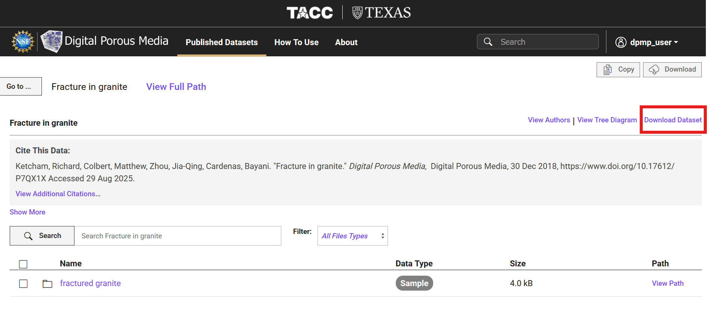
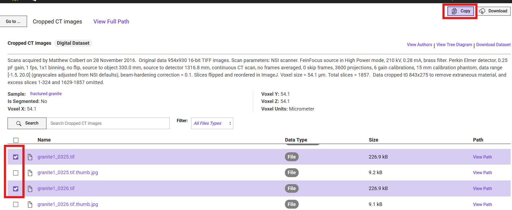
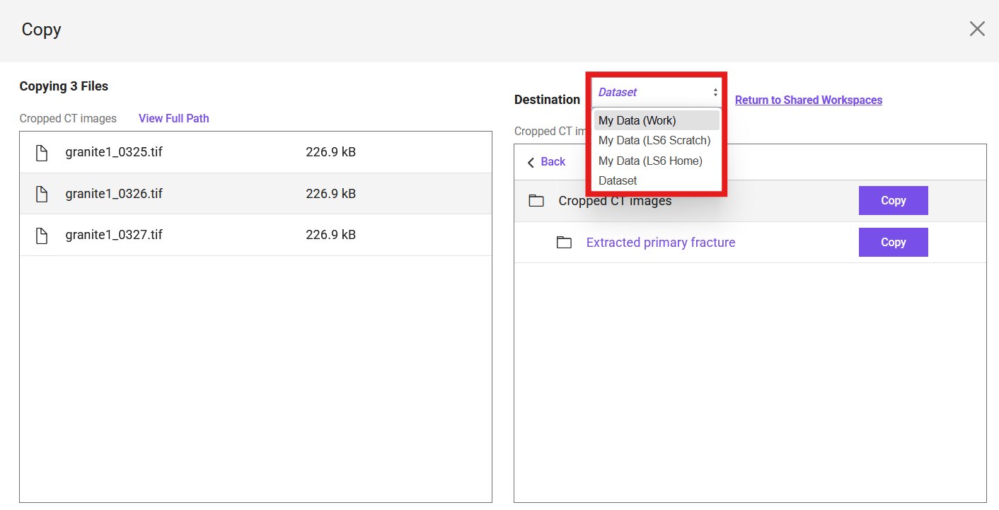

# Download or Copy a Dataset from DPMP
This guide explains how to locate and download a dataset or copy a dataset to your TACC storage from the portal.

## Step 1: Search for the Dataset

1. Navigate to the **Published Datasets** tab in the top menu.
2. Enter keywords in the search bar (e.g., ``granite fracture``) and press **Enter**.
3. A list of matching datasets will appear, for example:

   - *15 fractures of granite*
   - *Digitalized natural rock fracture of Inada Granite*
   - *Fracture in granite*

     

Click on the dataset title (e.g., *Fracture in granite*) to open its dataset page.

## Step 2: Download the Dataset

1. On the dataset page, review the dataset details (title, authors, citation, description).
2. Click the **Download Dataset** button in the upper-right corner.
3. Click on `Download` button that shows up in a window that explains the data size.
4. Your download will begin.

     

!!! note "Note"
    If the dataset is larger than 2 GB, you can use the following two alternatives: 

    **1. Globus:** Find the instructions on how to transfer data in [TACC's documentation](https://docs.tacc.utexas.edu/basics/datatransfer/#globus). 
    
    **2. Web Corral Interface:** Simply navigate to the corresponding dataset number [in this tree](https://web.corral.tacc.utexas.edu/digitalporousmedia/), and download the dataset.

## Step 3: Copy the Dataset to Your TACC Storage

Instead of downloading directly, you can copy selected files or folders from the dataset into your own TACC storage. Navigate to the dataset page.

1. Select the files or folders you want to copy by checking the boxes in the left-hand column.

2. Click the Copy button in the upper-right corner.

     

3. In the pop-up window, choose the destination system and path within your TACC storage where the files should be copied.

4. Confirm the action to start the transfer.

     

## Download vs Copy: Which One Should You Use?

Download → Use this option if you want the dataset on your local computer for immediate inspection, smaller-scale analysis, or offline storage.

Copy to TACC Storage → Use this option if you plan to work with the dataset on TACC’s HPC systems. Copying directly to your TACC storage avoids large transfers to your personal machine and enables direct use in computational workflows.

!!! note "Note"
    In the latest version of the portal, the list of publications may appear differently. 
    Each dataset will be displayed with a thumbnail preview, similar to how datasets were 
    shown in the earlier "Digital Rocks Portal."
