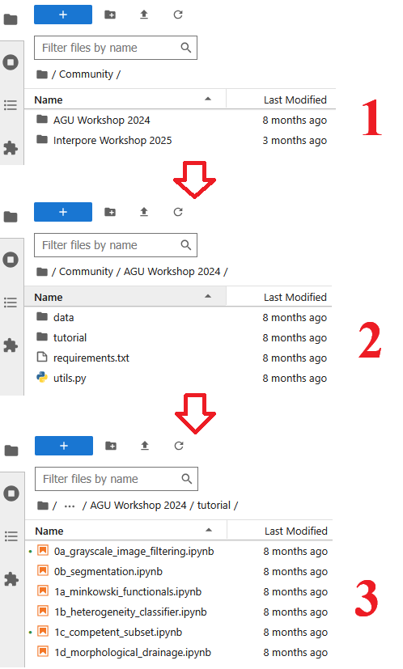

# How to Use 

This guide provides step-by-step instructions for using JupyterLab on Digital Porous Media Portal (DPM) datasets. 

## Launch JupyterLab Server

1.  Log in to the DPMP and navigate to the `My Dashboard` interface.

    

2. Navigate to the `Applications` tab in the left-hand menu (1). Then, navigate to `Data Processing` category (2). Click on `JupyterHub` from the list of available data processing applications (3). Finally, click the Digital Rocks Jupyter Hub link to launch the server.

    

!!! note "Note"
    Launching the server may take a couple of minutes.

## Use the Notebooks!

### Your Options in Jupyter Hub

Once your Jupyter Hub session is active, you have three main options to get started 🚀:

* **Use Your Own Data**: Create a new notebook to work with your personal files. You can find your data located in the /work directory.

* **Use Community Data**: Explore shared datasets provided by the community. This data is available in the /community directory. See [Community Data](./community_data.md) for more information.

* **Run Tutorials**: Follow the pre-made tutorial notebooks. You can run these tutorials using either the shared community data or your own data.

### Example of running tutorials
1. Navigate to the workshop that the tutorial was held.

2. Navigate to the tutorial folder.

3. Select your tutorial.

     

4. Follow along!

    