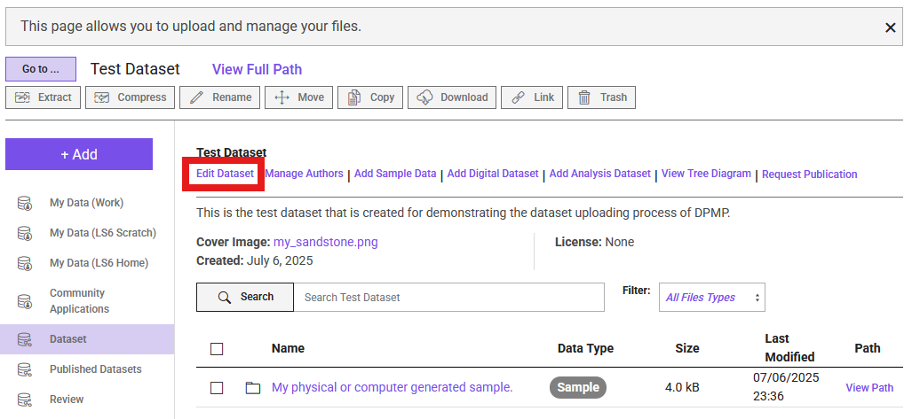
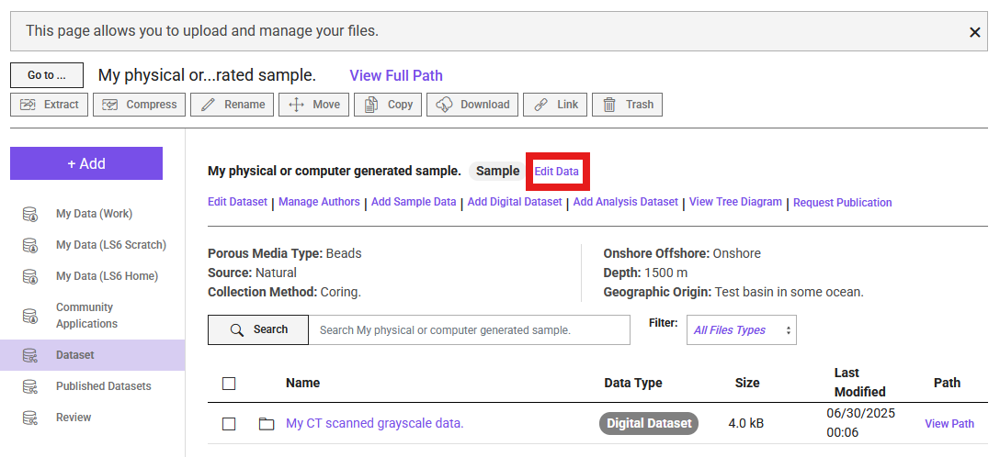
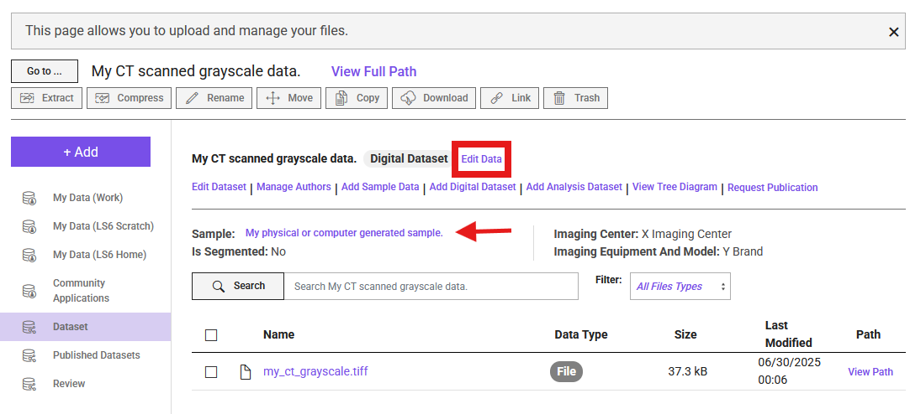

# Manage Your Data

During the upload process, you can enter information into forms. Based on our data model, each of the following entities requires a form to be completed:

1. Dataset (used to called as Project in DRP)
2. Sample Data
3. Digital Dataset
4. Analysis Dataset

## Edit Dataset Information
Navigate to your dashboard and select the dataset you are editing. Once inside the dataset folder, click the purple `Edit Data` button (see figure below). This button is always accessible within the dataset folder, regardless of the subfolder you are in.

## Edit Sample Information
To edit sample information, navigate to the directory of the specific sample. Once there, you will see a button next to the sample name labeled `Edit Data` (see figure below). Click this button to access the corresponding form.

## Edit Digital Dataset Information
To edit Digital Dataset information, navigate to the directory of the specific Digital Dataset from its parent sample. The process is the same as editing sample information. You will see a button next to the Digital Dataset name labeled `Edit Data` (see figure below). The arrow in the figure indicates the corresponding sample for the Digital Dataset.

## Edit Analysis Dataset Information
Editing an Analysis Dataset is similar to editing Digital Dataset and Sample Information. The only difference is that an Analysis Dataset may be a child (subdirectory) of a Digital Dataset or directly linked to a sample without a corresponding Digital Dataset in the same directory. Navigate to your Analysis Dataset, then click the `Edit Data` button to edit the information.

## Managing a Published Dataset
If you need to make changes to an already published project, please contact our [curation team](about_us.md#data-curation-software-digital-marketing).

!!! note "Note"
    If you need technical support at any point, please create a ticket through TACC and mention Digital Porous Media Portal. 
