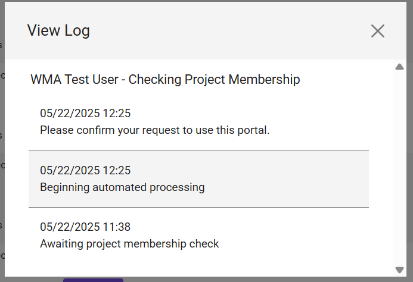

# Adding a New User to a Project Portal

!!! caution "Caution"
    This section contains information for admins.

There are several parts to adding a new user to a project portal:

## Initial Steps for User Access

**Step 1: User Request**
* The user must submit a ticket requesting access to the project portal. This ticket will be fielded to the Principal Investigator (PI).

**Step 2: PI Adds User in TACC Portal**
* If the PI approves the request, they must add the user to the Project and Allocations within the TACC User Portal.
* **TACC Portal Link:** [https://tacc.utexas.edu/portal/projects](https://tacc.utexas.edu/portal/projects)

**Step 3: PI Approves User in Project Portal**
* After adding the user to the Project and Allocations in the TACC Portal, the PI must then go to the Project Portal's onboarding admin section to "Approve" the new user requests.
* **DPM Onboarding Admin Link:** [https://digitalporousmedia.org/workbench/onboarding/admin](https://digitalporousmedia.org/workbench/onboarding/admin)

## Subsequent User Administration Actions (Onboarding Admin Dashboard)

Once a user has requested access, their status and onboarding progress can be managed in the project portal onboarding admin dashboard.

* **Awaiting Approval:** Users who have requested access and are awaiting PI approval for onboarding will appear in the dashboard.
    * 
* **Approving a User:**
    * Clicking the "Approve" button next to a user's request will send an email to the user. This email asks them to verify their request for access to the specific portal.
    * Once the user responds to the verification email, the Project Portal will attempt to execute the onboarding workflow for that user.
* **Successfully Onboarded Users:** Users who have been successfully processed for onboarding will be displayed accordingly.
    * 
* **Handling Onboarding Errors:**
    * If a user fails a check during the onboarding process (e.g., Project Membership check, Allocations check, or System Access check) *after* PI approval, a log of the error will be available.
    * These logs can be accessed by clicking the "view log" link next to each step in the procedure for that user.
        * 
* **Manual Step Management (Reset/Skip):**
    * If a user is stuck on a specific onboarding step, the PI has options:
        * **Reset:** Clicking the "Reset" link next to the failing step will attempt to re-run that step. This is often useful if a blocking issue (like missing Project/Allocation assignment or delayed System Access key generation) has since been resolved.
        * **Skip:** If an onboarding step is blocking the user and the PI is confident in allowing the user access despite the error, they can click the "Skip" link to bypass that particular step in the workflow.
    * **Note:** Any users for whom steps were "skipped" should be investigated to identify and resolve the underlying blocker. Once the blockers are removed, "Resetting" the skipped step should allow it to complete successfully.