# LBPM MRT CPU Simulation

This guide provides step-by-step instructions for running Lattice Boltzmann for Porous Media (LBPM) single-phase (MRT) permeability simulations on x86 CPUs using the Digital Porous Media Portal (DPMP).

## Launch the Application

1. Log in to the DPMP and navigate to the `My Dashboard` interface.

    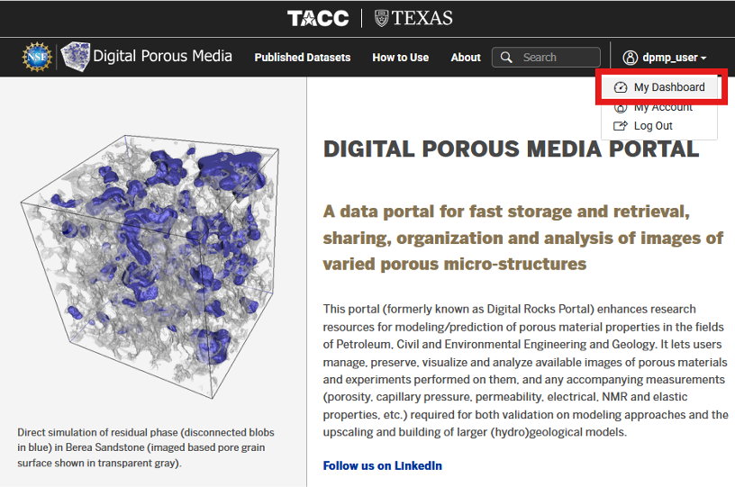

2. Navigate to the `Applications` tab in the left-hand menu (1). Then, navigate to the `Simulation` category (2). Click on `LBPM MRT CPU (Lonestar6)` from the list of available simulation applications (3).

    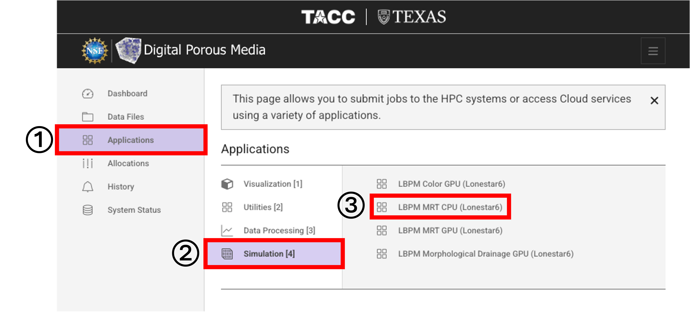

## Inputs

1. Under `Inputs`, click `Select` next to `Input File` to browse for the input database (`.db`) file for the LBPM simulation.

    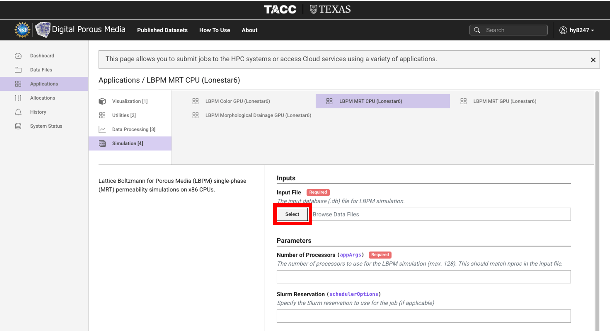

2. Navigate to the file location and select the input file.

    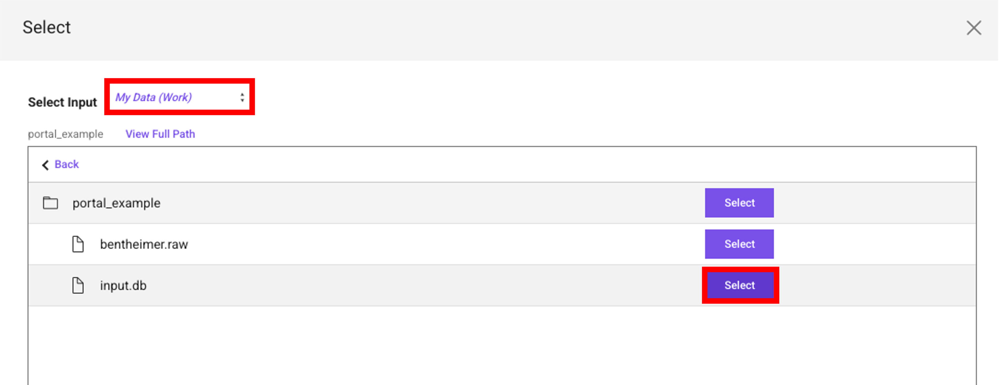

3. Below is an example `input.db` file for a single-phase (MRT) LBPM simulation. In this example, `nproc` is set to `1, 1, 1`, for a total of 1 processor.

    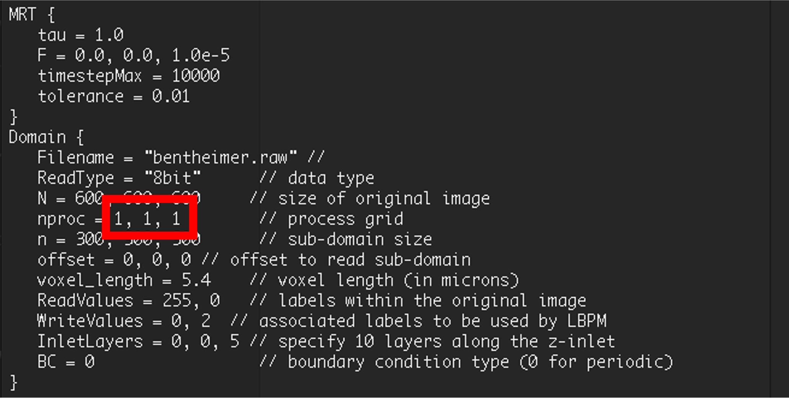

## Parameters

1. Enter the `Number of Processors` for the LBPM simulation. This value must match `nproc` in the selected `input.db` file.

    - In this example, `nproc = 1, 1, 1`, so the number of processors is `1`.

    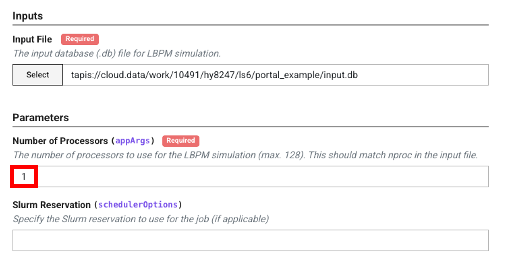

!!! note "Note"
    The number of processors cannot exceed 128.

## Configuration

1. Select the `Allocation` you would like to use for this job submission, then select the `Queue` this job will execute on.

    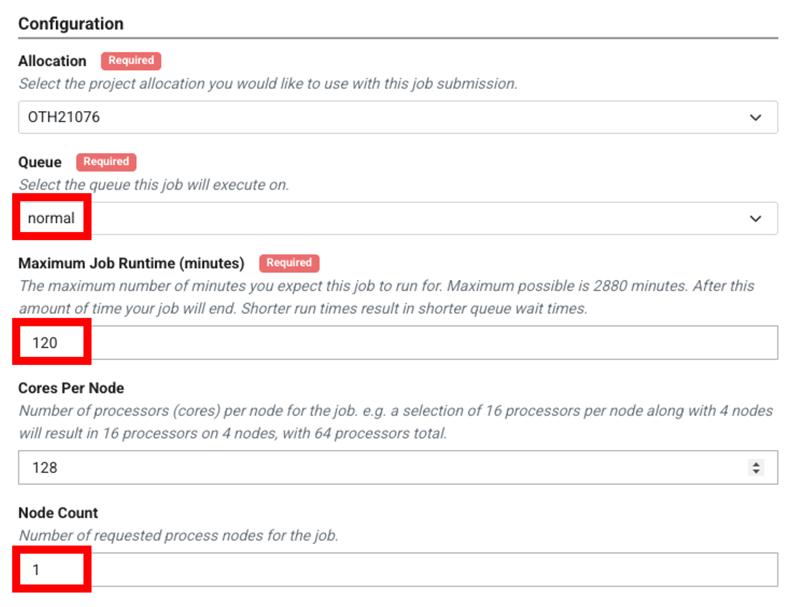

    - The current status of queues on Lonestar6 (idle nodes, running jobs, and waiting jobs) can be found at `System Status > Lonestar6`.

        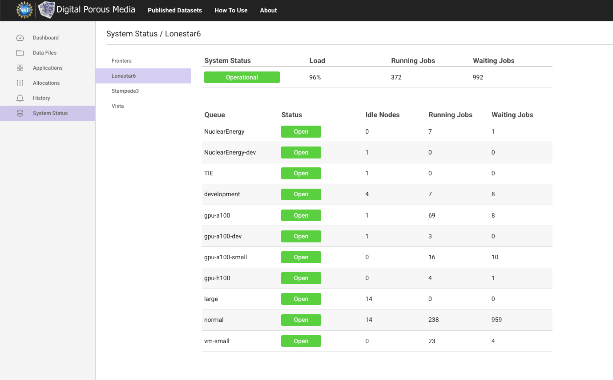

    - A detailed description of available queues on Lonestar6 can be found in the [TACC Lonestar6 documentation](https://docs.tacc.utexas.edu/hpc/lonestar6/#production-queues).

2. Set the `Maximum Job Runtime`, `Cores Per Node`, and `Node Count` for the job.

## Outputs

1. Enter a `Job Name`, and specify the `Archive System` and `Archive Directory` where output files will be stored after the job completes. Click Submit. The default `Archive System`, cloud.data, points to the `$WORK` file system on Lonestar6. The default `Archive Directory` creates a folder named `tapis-jobs-archive` under the user's `$WORK` directory, where output files can be found after the job completes. To archive outputs to a different location within `$WORK`, provide the absolute path to the desired directory, for example `/work/<useridentifier>/<username>/ls6/my_output_folder`, in place of the default. To archive outputs to `$SCRATCH` instead, set the `Archive System` to `ls6` and provide the absolute path to the desired directory on the `$SCRATCH` file system.

    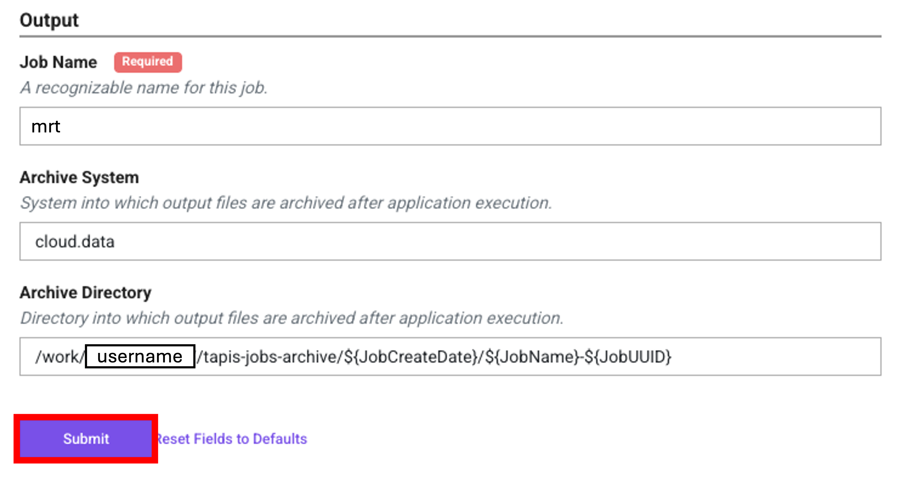

2. Once submitted, you will see a confirmation message.

    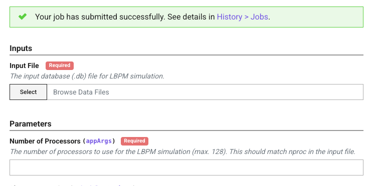

## Monitor and Retrieve Results

1. Navigate to `History > Jobs`, find your job by `Job Name`, and click `View Details`.

    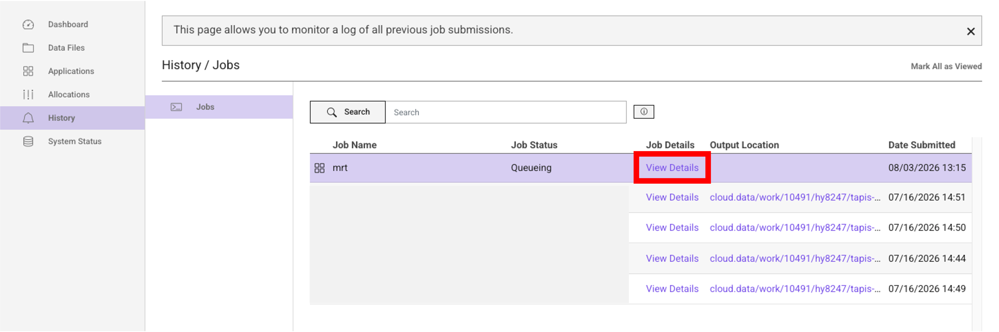

2. In the job details panel, click `View in Data Files` under `Output` to access your output files.

    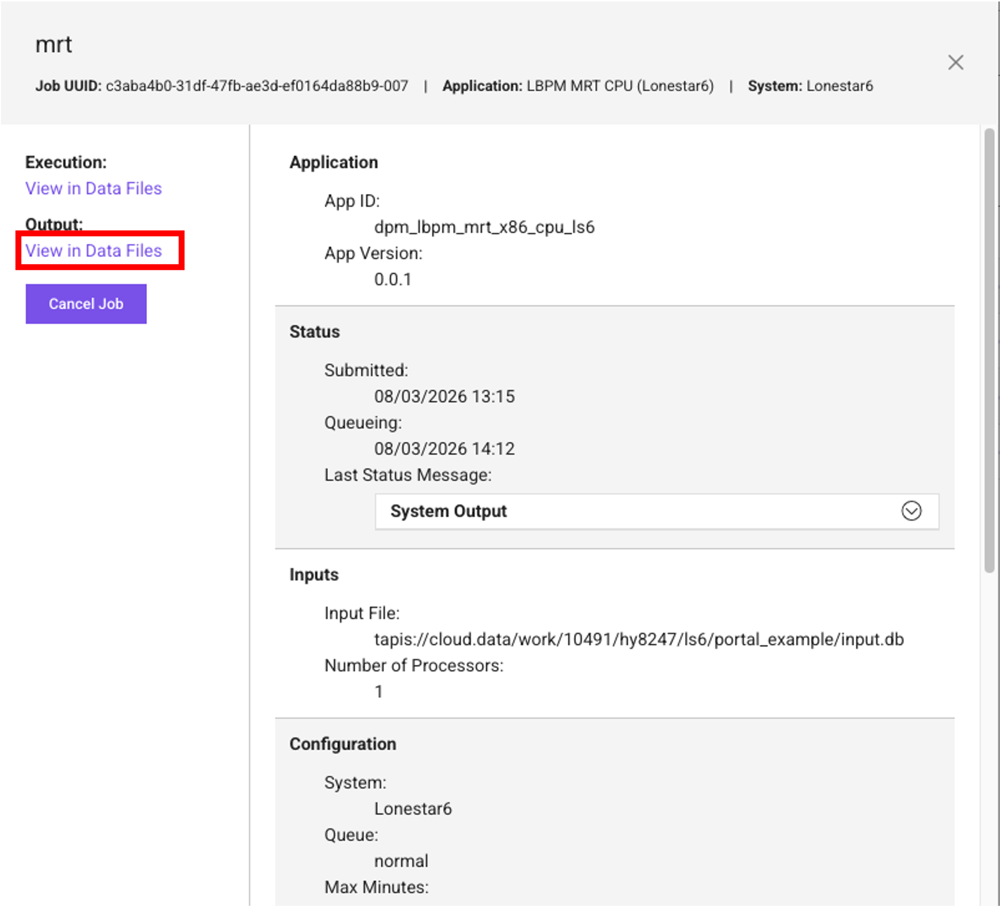