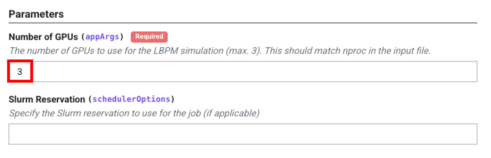

# LBPM Simulation

This guide provides step-by-step instructions for running Lattice Boltzmann for Porous Media (LBPM) on the Digital Porous Media Portal (DPMP) for:

1. Single-phase (MRT) permeability simulations on x86 CPUs
2. Single-phase (MRT) permeability simulations on GPUs
3. Morphological drainage simulations on GPUs
4. Multiphase (Color) simulations on GPUs


## Launch the Application

1. Log in to the DPMP and navigate to the `My Dashboard` interface.

    

2. Navigate to the `Applications` tab in the left-hand menu (1). Then, navigate to the `Simulation` category (2). Click on the simulation tool you want (e.g., `LBPM MRT CPU (Lonestar6)`) from the list of available simulation applications (3).

    

## Inputs

1. Under `Inputs`, click `Select` next to `Input File` to browse for the input database (`.db`) file for the LBPM simulation. Here, a pore of Berea sandstone (a.k.a. the Chicken pore) is used as an example.

    

2. Navigate to the file location and select the input file.

    

3. Use the appropriate input file for each type of simulation.

    ### Single-phase (MRT) permeability simulations on x86 CPUs


    Below is an example `input.db` file for a single-phase (MRT) LBPM simulation. In this example, `nproc` is set to `1, 1, 1`, for a total of 1 processor.

    ```ini
    Domain {
    Filename = "berea_pore_110.raw"
    ReadType = "8bit"
    nproc = 1, 1, 1
    n = 110, 110, 110
    N = 110, 110, 110
    voxel_length = 1
    ReadValues = 1, 0
    WriteValues = 0, 2
    BC = 0
    }

    MRT {
    tau = 0.7
    F = 0.0, 0.0, 1.0e-5
    timestepMax = 1000000
    tolerance = 0.0001
    }
    ```

    ### Morphological drainage simulations

    Below is an example `input.db` file for a morphological drainage LBPM simulation. In this example, `nproc` is set to `1, 1, 1`, for a total of 1 processor.

    ```ini
    Domain {
    Filename = "berea_pore_110.raw"
    ReadType = "8bit"
    nproc = 1, 1, 1
    n = 110, 110, 110
    N = 110, 110, 110
    voxel_length = 1
    ReadValues = 1, 0
    WriteValues = 0, 2
    BC = 0
    Sw = 0.10
    }
    ```

    ### Multiphase (Color) simulations

    Below is an example `input.db` file for a color LBPM simulation. In this example, `nproc` is set to `1, 1, 3`, for a total of 3 processors.

    ```ini
    Domain {
    Filename = "berea_pore_110.raw"
    ReadType = "8bit"
    nproc = 1, 1, 1
    n = 110, 110, 110
    N = 110, 110, 110
    voxel_length = 1
    ReadValues = 1, 0
    WriteValues = 0, 2
    BC = 0
    Sw = 0.10
    }

    MRT {
    tau = 0.7
    F = 0.0, 0.0, 1.0e-5
    timestepMax = 1000000
    tolerance = 0.0001
    }

    Color {
        protocol = "fractional flow"
        capillary_number = 1e-3
        tauA = 0.7             // relaxation time for fluid A (labeled as "1")
        tauB = 0.7             // relaxation time for fluid B (labeled as "2")
        rhoA   = 1.0           // density for fluid A (in lattice units)
        rhoB   = 1.0           // density for fluid B (in lattice units)
        alpha = 5e-3           // controls the surface tension
        beta  = 0.95           // controls the interface width
        F = 0, 0, 1e-4          // controls the external force
        Restart = false         // initialize simulation from restart file?
        timestepMax = 10000000  // maximum number of timesteps to perform before exit
        ComponentLabels = 0     // number of immobile component labels in the input image
        ComponentAffinity = 1.0 // wetting condition for each immobile component
        WettingConvention = "SCAL"
    }

    Analysis {
        analysis_interval = 10000        // Frequency to perform analysis
        visualization_interval = 10000   // Frequency to write visualization data
        restart_interval = 1000000       // Frequency to write restart data
        restart_file = "Restart"         // Filename to use for restart file (will append rank)
        N_threads    = 3                 // Number of threads to use for analysis
        load_balance = "default"         // Load balance method to use: "none", "default", "independent"
    }

    Visualization {
        format = "hdf5"
        write_silo = true        // write SILO databases with assigned variables
        save_8bit_raw = true     // write labeled 8-bit binary files with phase assignments
        save_phase_field = true  // save phase field within SILO database
        save_pressure = true     // save pressure field within SILO database
        save_velocity = true     // save velocity field within SILO database
    }

    FlowAdaptor {
        fractional_flow_increment = 0.05
        endpoint_threshold = 0.1
        skip_timesteps = 10000
        min_steady_timesteps = 50000
        
        max_steady_timesteps = 500000
    }
    ```

    !!! note "Note"
        A detailed description and example input files of simulations can be found in the [LBPM Documentation](https://lbpm-sim.org/).


## Parameters

### CPU

Enter the `Number of Processors` for the LBPM simulation. This value must match `nproc` in the selected `input.db` file.

- In this example, `nproc = 1, 1, 1`, so the number of processors is `1`.

    

!!! note "Note"
    The number of processors cannot exceed 128.

### GPU

Enter the `Number of GPUs` for the LBPM simulation. This value must match `nproc` in the selected `input.db` file.

- In this example, `nproc = 1, 1, 3`, so the number of processors is `3`.

    

!!! note "Note"
    The number of GPUs cannot exceed 3.


## Configuration

1. Select the `Allocation` to be used for this job submission, then select the `Queue` on which this job will execute.
    - For CPU, available queues include `normal`, `vm-small`, etc.
    - For GPU, available queues include `gpu-a100-small`, `gpu-a100`, `gpu-h100`, etc.
    - A detailed description of available queues on Lonestar6 can be found in the [TACC Lonestar6 documentation](https://docs.tacc.utexas.edu/hpc/lonestar6/#production-queues).

    

    - The current status of queues on Lonestar6 (idle nodes, running jobs, and waiting jobs) can be found under `System Status > Lonestar6`.

        

2. Set the `Maximum Job Runtime`, `Cores Per Node`, and `Node Count` for the job. In most cases, a `Node Count` of 1 is recommended.


## Outputs

1. Enter a `Job Name`, and specify the `Archive System` and `Archive Directory` where output files will be stored after the job completes. Click `Submit`.

    - The default `Archive System`, `cloud.data`, points to the `$WORK` file system on Lonestar6. The default `Archive Directory` creates a folder named `tapis-jobs-archive` under the user's `$WORK` directory, where output files can be found after the job completes.

    - To archive outputs to a different location within `$WORK`, provide the absolute path to the desired directory, for example `/work/<useridentifier>/<username>/ls6/my_output_folder`, in place of the default.

    - To archive outputs to `$SCRATCH` instead, set the `Archive System` to `ls6` and provide the absolute path to the desired directory on the `$SCRATCH` file system.

    | Output Directory | Archive System | Archive Directory |
    |---|---|---|
    | Default | `cloud.data` | `/work/<useridentifier>/tapis-jobs-archive/${JobCreateDate}/${JobName}-${JobUUID}` |
    | Work folder | `cloud.data` | path to directory in `$WORK` folder (ex: `/work/<useridentifier>/<username>/ls6/my_output_folder`) |
    | Scratch folder | `ls6` | path to directory in `$SCRATCH` folder (ex: `/scratch/<useridentifier>/<username>/my_output_folder`) |

    

2. Once submitted, a confirmation message will be displayed.

    

## Monitor and Retrieve Results

1. Navigate to `History > Jobs`, locate the job by `Job Name`, and click `View Details`.

    

2. In the job details panel, click `View in Data Files` under `Output` to access the output files.

    
