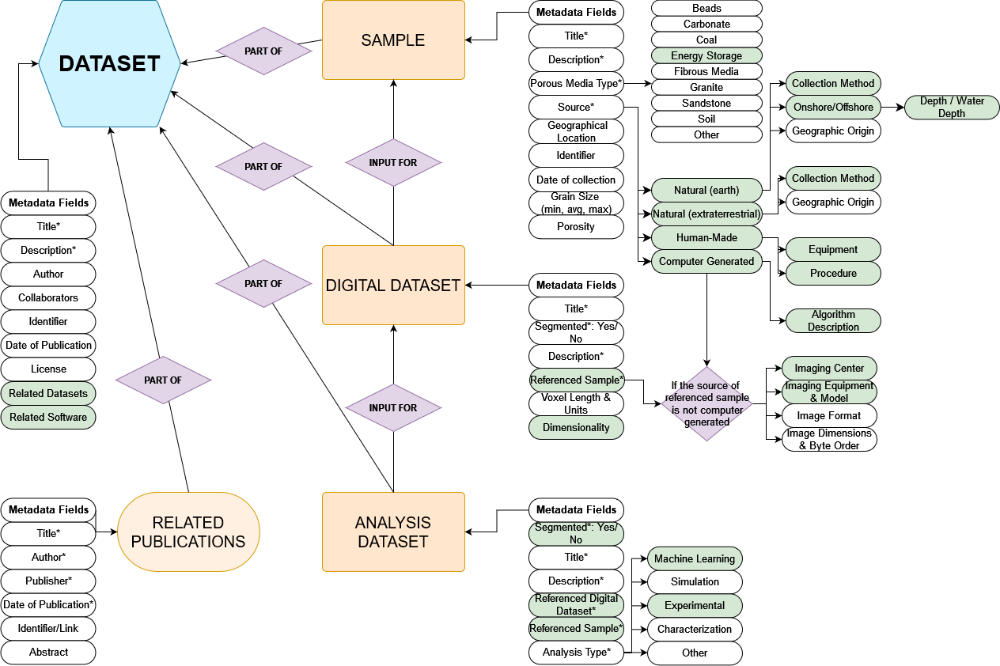
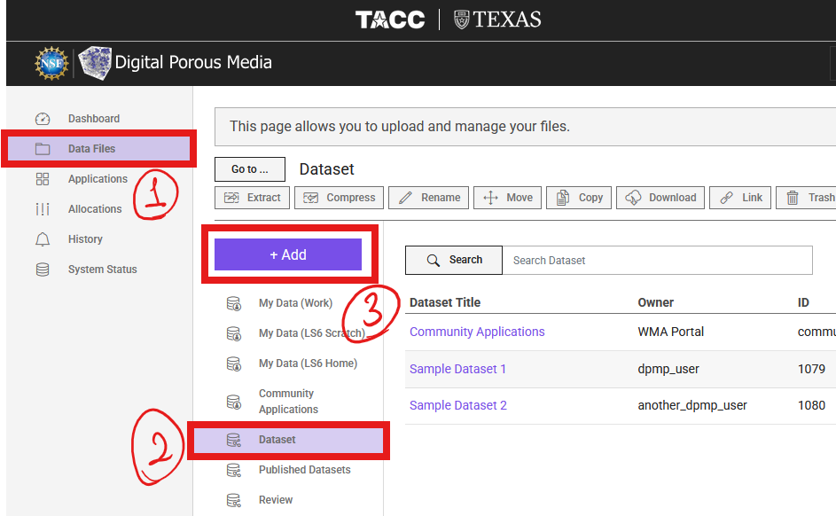
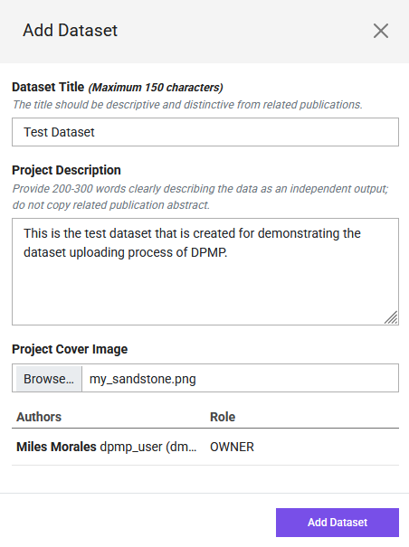
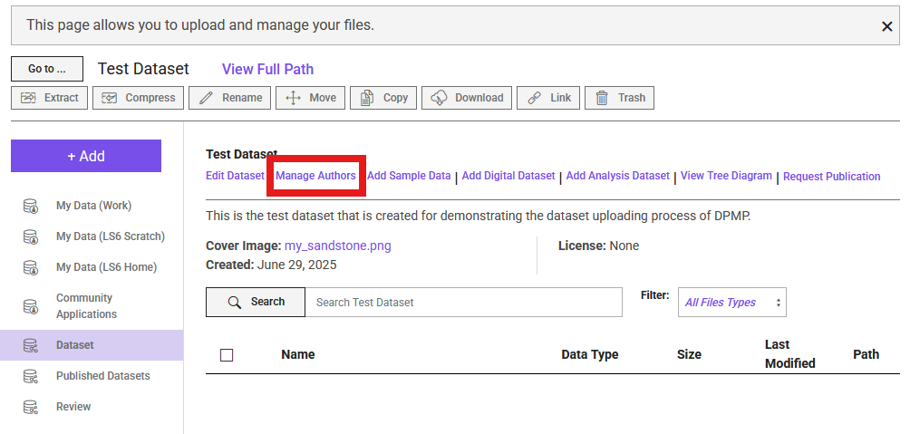
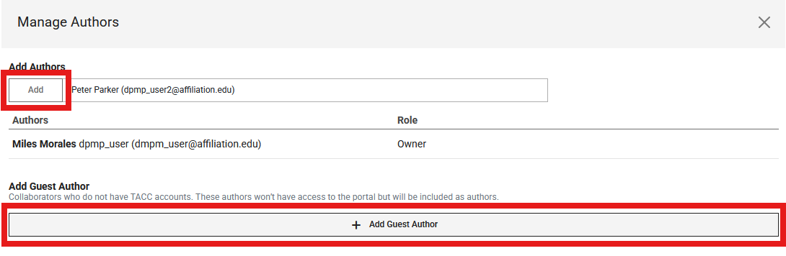
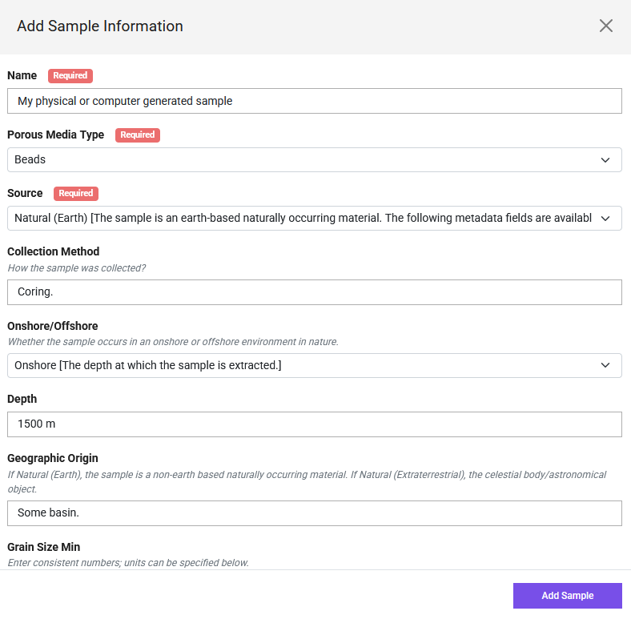
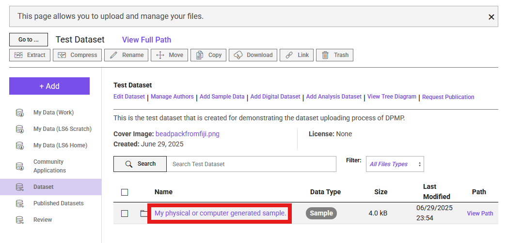
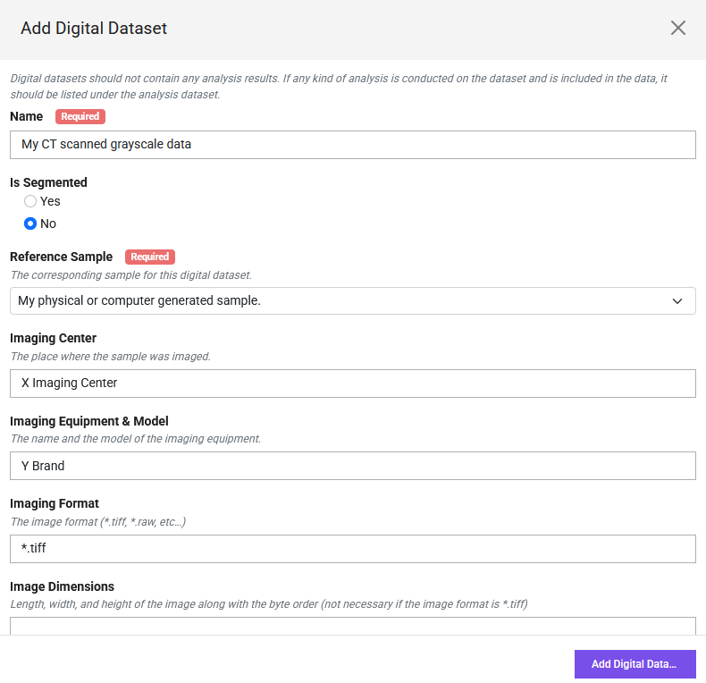
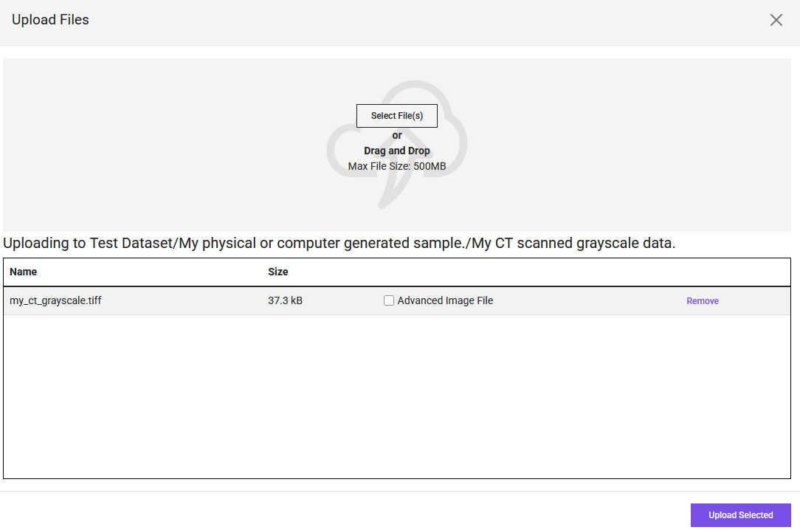

# How to Upload Data: A Step-by-Step Guide

This guide provides step-by-step instructions for uploading your porous media datasets to the Digital Porous Media Portal (DPM). Following these steps helps ensure your data is well-described, discoverable, and usable by the community.

## Data Model
Before you begin uploading, it's helpful to understand that the Digital Porous Media Portal (DPMP) uses a **data model** to organize and describe datasets. This data model defines how your files, projects, and metadata are structured within the portal. **Mandatory** metadata fields are marked with asterisks (\*), indicating they are required for publication and discoverability. Some fields are highlighted in **green**—these represent updates or new fields added since the previous model. Metadata requirements may vary depending on the data type (e.g., image, raw binary, processed data). By following this model, DPMP ensures that all datasets are consistently described, making them easier to search, interpret, and reuse.

Below is a visual overview of the data model and its metadata requirements:

---

## Upload 

**Before You Begin:**

* **Account:** Ensure you have registered for a TACC account at [https://accounts.tacc.utexas.edu/register](https://accounts.tacc.utexas.edu/register) and are logged into the DPM.
* **Data Organization:** Plan the structure of your data. Consider distinguishing between originating raw data and derived analysis data. It's often helpful to organize your files and folders locally on your computer or cloud storage (like Dropbox/UT Box) *before* uploading. You can refer to the data model for such organization.

* **File Size:**
    * If your total dataset **exceeds 2GB**, please **email the DPMP staff first** to discuss the upload.
    * Consider splitting very large volumetric files into smaller, manageable chunks (e.g., under 2GB each) before uploading. This aids users with downloading and processing the data later.
* **Compression:** **Avoid compressing** individual image files (e.g., into `.zip` or `.tar.gz` archives) before uploading if possible. Uploading standard image formats (e.g.,  `*.tiff`, `*.raw`) directly allows the portal to automatically generate previews (like GIF movies) and perform basic analysis (like histograms). Use the portal's bulk upload options (Dropbox, UTBox) for transferring many files or large files efficiently.

---

### Step 1: Create a Dataset
All data on DPMP belongs to a "Dataset" entity. So, this will be the starting point.

1.  Log in to the DPMP and navigate to the `My Dashboard` interface.

    

2. Within the dashboard, select the `Data Files` from the left column (1 in the image below). Then, navigate to `Dataset` directory (2), and select `+ Add` (3).

    

3. From the dropdown list, select `Dataset`.

4. Fill in the "Dataset Title", "Description", and attach a cover image. Then, click `Add Dataset`.

    
Now, the dataset is created and the portal navigated inside that directory! Congrats 🎉!

### Step 2: Add Collaborators

1.  To add the project members or collaboratiors, select `Manage Authors` from the options.

    

2. From the pop-up menu, search and add the TACC account holder users using their registered DPMP/TACC username or email and select `+ Add`, or select `+ Add Guest Author` to add contributors without TACC accounts.

    

3. TACC user collaborators can edit the project and upload data.

### Step 3: Add Sample Information

1. Select the `Add Sample Data` option next the the Manage Authors. Fill in the pop-up form.

    

2. After creating the sample information, navigate to the sample directory by clicking at its name.

    

### Step 4: Add Digital Dataset

1. Similar to the sample information, this time, select `Add Digital Dataset' option. Fill out the pop-up form.

    

2. Then, similar to what we did after sample information, navigate to the digital dataset folder.

3. Click the purple `+ Add` button, and select `Upload`. This is how that step should look like after selecting files.
    

### Step 5: Add Analysis Dataset

1. To add the Analysis Dataset, navigate back to the sample information directory. You can do this using the back button of your browser, or navigate through the `Go to ...` option on the left of the main dataset name.

2. Select `Add Analysis Dataset` this time, and fill out the corresponding information.

3. Navigate to its directory after filling out the form, and Upload data similar to the digital dataset.

### Step 6: Request Publication
...
<!--

1.  **Project Description:** Provide a clear description of the overall project, the physical sample(s), and the experiment(s) involved. Link to relevant publications if available.
2.  **File-Level Metadata:** For each uploaded data file (especially images), provide necessary details.
3.  **Minimum Requirements:** The DPM enforces minimum metadata standards. Pay attention to warnings indicating missing required information. The more detail you provide, the more valuable your dataset becomes.
4.  **Critical Metadata for Raw Binary Images:** Raw binary files (`.raw`, `.bin`, etc.) do not contain size or format information internally. To allow DPM to display them correctly, you **must** provide:

    * **Voxel Dimensions:** The number of voxels (pixels in 3D) in each direction (e.g., width, height, depth/slices).
    * **Voxel Size:** The physical size of one voxel (e.g., in µm). If not applicable (e.g., for synthetic data), enter '1' and make a note in the description.
    * **Data Type:** The numerical format (e.g., 8-bit unsigned integer, 16-bit signed integer, 32-bit float).
    * **Byte Order (Endianness):** Specify 'Big Endian' or 'Little Endian'. This is critical for multi-byte data types (16-bit, 32-bit, etc.). If unsure, you might need to try both – upload the metadata, check the preview (Step 5), and edit if it looks scrambled. (Note: For 8-bit data, byte order doesn't typically matter).
    * *Tip:* If unsure about these parameters, try opening your raw file in software like ImageJ/Fiji locally first to determine the correct settings.

**Step 5: Verify Previews (Especially for Volumetric Images)**

1.  After the upload and metadata entry, the portal will often attempt to generate a preview (e.g., a GIF movie slicing through a 3D volume).
2.  Check the preview on the project page. Does it look as expected?
3.  **Troubleshooting Low-Range Binary Data:** If you uploaded segmented data (e.g., values 0, 1, 2) as a raw binary file, the preview might initially look black or very dark. This is because the visualizer scales to the full potential range (e.g., 0-255 for 8-bit). To fix this:
    * Navigate to the specific image file within your project.
    * Click the **"Actions"** tab/button associated with that file.
    * Select **"Edit"**.
    * Find and check the option labeled **"Use binary correction"** (or similar wording).
    * **Save Changes**.
    * The task to re-render the preview will be queued, and it should update shortly to display the limited range correctly.

**Step 6: Review and Finalize**

Your uploaded data is now stored **privately** within your project.

* Review all uploaded files and metadata for accuracy and completeness.
* You can continue to add/edit data and metadata while the project remains private.
* Once you are satisfied and ready to make the data public, you can proceed with the publication request process (covered in the "Publish Datasets" guide - `publish.md`). Metadata cannot be easily edited by you after publication.

---

For further details on specific file formats or metadata fields, please refer to the relevant sections of the documentation. If you encounter issues, contact the DPM support team.

-->
