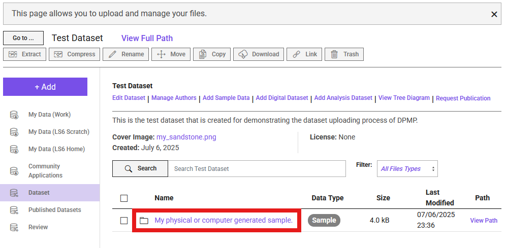

# How to Upload Data: A Step-by-Step Guide

This guide provides step-by-step instructions for uploading your porous media datasets to the Digital Porous Media Portal (DPM). Following these steps helps ensure your data is well-described, discoverable, and usable by the community.

## Data Model
Before you begin uploading, it's helpful to understand that the Digital Porous Media Portal (DPMP) uses a **data model** to organize and describe datasets. This data model defines how your files, datasets (previously, in Digital Rocks Portal, datasets were called projects), and metadata are structured within the portal. **Mandatory** metadata fields are marked with asterisks (\*), indicating they are required for publication and discoverability. Some fields are highlighted in **green**—these represent updates or new fields added since the previous model. Metadata requirements may vary depending on the data type (e.g., image, raw binary, processed data). By following this model, DPMP ensures that all datasets are consistently described, making them easier to search, interpret, and reuse.

Below is a visual overview of the data model and its metadata requirements:

---

## Before You Begin:

### Account
Ensure you have registered for a TACC account at [https://accounts.tacc.utexas.edu/register](https://accounts.tacc.utexas.edu/register) and are logged into the DPM.
### Data Organization
 Plan the structure of your data. Consider distinguishing between originating raw data and derived analysis data. It's often helpful to organize your files and folders locally on your computer or cloud storage (like Dropbox/UT Box) *before* uploading. You can refer to the data model for such organization.

### Data Transfer Options
* If your total dataset **exceeds 2GB**, please **email the DPMP staff first** to discuss the upload. The current upload options are through Globus and Cyberduck.  
* Consider splitting very large volumetric files into smaller, manageable chunks (e.g., under 2GB each) before uploading. For chunks or datasets smaller than 2GB, the worklfow described below can be used for uploading through the portal platform. Having chunked datasets also aids users with downloading and processing the data later, 

### Compression:
**Avoid compressing** individual image files (e.g., into `.zip` or `.tar.gz` archives) before uploading if possible. Uploading standard image formats (e.g.,  `*.tiff`, `*.raw`) directly allows the portal to automatically generate previews (like GIF movies) and perform basic analysis (like histograms). 

## Upload 
---

### Step 1: Create a Dataset
All data on DPMP belongs to a "Dataset" entity. So, this will be the starting point.

1.  Log in to the DPMP and navigate to the `My Dashboard` interface.

    

2. Within the dashboard, select the `Data Files` from the left column (1 in the image below). Then, navigate to `Dataset` directory (2), and select `+ Add` (3).

    

3. From the dropdown list, select `Dataset`.

4. Fill in the "Dataset Title", "Description", and attach a cover image. Then, click `Add Dataset`.

    
Now, the dataset is created and the portal navigated inside that directory! Congrats 🎉!

### Step 2: Add Collaborators

1.  To add the dataset members or collaboratiors, select `Manage Authors` from the options.

    

2. From the pop-up menu, search and add the TACC account holder users using their registered DPMP/TACC username or email and select `+ Add`, or select `+ Add Guest Author` to add contributors without TACC accounts.

    

3. TACC user collaborators can edit the dataset and upload data.

### Step 3: Add Sample Information

1. Select the `Add Sample Data` option next the the Manage Authors. Fill in the pop-up form.

    

2. After creating the sample information, navigate to the sample directory by clicking at its name.

    

### Step 4: Add Digital Dataset

1. Similar to the sample information, this time, select `Add Digital Dataset' option. Fill out the pop-up form.

    

2. Then, similar to what we did after sample information, navigate to the digital dataset folder.

3. Click the purple `+ Add` button, and select `Upload`. This is how that step should look like after selecting files.
    

### Step 5: Add Analysis Dataset

1. To add the Analysis Dataset, navigate back to the sample information directory. You can do this using the back button of your browser, or navigate through the `Go to ...` option on the left of the main dataset name.

2. Select `Add Analysis Dataset` this time, and fill out the corresponding information.

3. Navigate to its directory after filling out the form, and Upload data similar to the digital dataset.

### Step 6: Request Publication

Once all data and corresponding metadata are complete, your dataset is ready for review by our curation team. To initiate the review process, click the `Request Publication` button (see figure). This will open a review page where you can verify the information you provided and view the data tree for your dataset. After reviewing your submission, if no mandatory information is missing, you will see the `Submit Publication Request` option. Clicking this will send your review request to our curation team.

You can expect to hear back from our curation team within one week. If clarification or additional information is needed for your dataset, you will be contacted via email.

## Curate Your Dataset

This section explains the best practices for filling out the metadata for your dataset. The goal is to make your data Findable, Accessible, Interoperable, and Reusable (FAIR). As computational science relies on shared data and code, creating a well-described, reproducible dataset is a critical contribution to the scientific community. Following these guidelines will ensure your dataset is a standalone research output that increases the visibility and impact of your work.

Required fields are marked with an asterisk (*).

### 1. Dataset

This is the main container for your work, connecting the physical sample, digital data, analysis, and any related publications.

*   **Title***: The main title for all the information to be uploaded.
    *   **Best Practice:** Be descriptive, concise, and optimized for search. A good title helps others find your data. Instead of "Rock Scan," use a specific title like: "3D Micro-CT image of Bentheimer sandstone after triaxial compression." Include the sample material, location, and key experimental conditions if applicable.

*   **Description***: Description of the dataset.
    *   **Best Practice:**  This is the "abstract" for your dataset and is the most important field for discoverability and reuse. When writing the description, think of a researcher searching for data. They should be able to quickly determine if your dataset is useful to them.

        *   **Start with a broad summary:** Begin with language appropriate for a general audience. Explain the overall purpose and content of the dataset without discipline-specific jargon.
        *   **Describe the context:** Data is not created in a vacuum. Explain the original research question and the context in which the data were created. This is necessary for evaluating the data's provenance and completeness.
        *   **Detail the contents and methods:** For experts, describe the specific files included (e.g., raw data, processed images, analysis results), the methods used to generate them, and any limitations.
        *   **Use a structured format:** For clarity, consider using consistent headings like **Background**, **Methods**, and **Dataset Contents**. This makes the description more readable and helps provide consistency across the portal.

*   **Collaborators**: People who contributed to this dataset. The collaborators need to have a Texas Advanced Computing Center (TACC) account if they would need to see and modify it. Otherwise, there is a guest option that allows adding the collaborators without access.
    *   **Best Practice:** Acknowledge everyone who contributed to the dataset's creation, including data collection, processing, and analysis. This ensures proper credit and transparency.

*   **Related Publications**: Publications that cite or provide context for the published dataset.
    *   **Best Practice:** Linking your dataset to publications is mutually beneficial; it increases the visibility and impact of both. This section allows you to create a rich web of context for your data.
    *   **Type***: Select the relationship between your dataset and the publication you are adding.
        *   **Cited by**: Choose this if the publication (e.g., a journal article, conference paper) analyzes, mentions, or is based on this dataset. This is the most common and important link to establish.
        *   **Context**: Use this for a resource that provides essential background but does not directly use the data. Examples include a paper describing the experimental method, the equipment used, or the geological formation from which a sample was taken.
        *   **Linked Dataset**: Select this to link to a *data paper* or a record in another repository that describes a related dataset. This helps connect your data to a broader project or a previous version.
    *   **Publication Title***: Provide the full title of the article, paper, or resource.
    *   **URL or DOI, in URL format***: Provide a persistent link to the publication.
        *   **Best Practice:** A Digital Object Identifier (DOI) is strongly preferred as it is a permanent link. Please format it as a complete URL. If a DOI is not available, use a direct URL to the publication's webpage.

*   **Related Datasets**: A dataset can be a part of a larger project, which contains several different phases and/or datasets. This is the link to those related datasets.
    *   **Best Practice:** If this dataset is part of a series (e.g., scans at different stages of an experiment), link them here using their titles, URLs, or DOIs. This provides a complete picture of the research provenance.

*   **Related Software**: The software used to work with the dataset. The software can be a visualization, simulation, analysis, a similar program, or a code workflow.
    *   **Best Practice:** For true reproducibility, linking the data to the code that produced or analyzed it is essential. This allows others to verify your findings and build upon your work.
    *   **Software Title***: Provide the full name of the software, script, or code workflow. For reproducibility, it is highly recommended to include a version number (e.g., "ImageJ-Fiji v2.9.0" or "PoreNetworkExtraction.py v1.2").
    *   **Software Description***: Briefly explain the function of the software or code. What does it do (e.g., visualization, simulation, analysis)? How does it interact with the dataset? Mentioning key dependencies or the programming language can also be very helpful for others trying to reuse it.
    *   **URL or DOI, in URL format***: Provide a direct and persistent link to the software. A link to a version-controlled repository like GitHub is good, but a link to a specific release or commit is even better. For the highest level of persistence and citability, archive your code on a repository like Zenodo to obtain a DOI. Always format the link as a full URL.

*   **Related Software**: The software used to work with the dataset.
    *   **Best Practice:** For reproducibility, this field is essential. Provide a link (preferably to a GitHub repository or a DOI from a repository like Zenodo) to the specific version of the code or software used for data acquisition, processing, or analysis.

*   **License**: DPMP datasets can be licensed under ODC-By v1.0 (Open Data Commons Attribution License v1.0).
    *   **Best Practice:** The license determines how others can use your data. While ODC-By v1.0 is the standard, ensure you understand its terms.

*   **Identifier**: A DOI is provided by DPMP for the dataset.
    *   **Best Practice:** Once published, DPMP will assign a unique and persistent Digital Object Identifier (DOI) to your dataset. Use this DOI in the citation of your dataset in any related publications.

### 2. Sample

This section describes the physical or digitally generated porous specimen. The information you provide here is the foundation for the digital and analysis datasets that will be linked to it.

#### Core Sample Information

These two fields are always required.

*   **Name***: The unique name or identifier for the sample.
    *   **Best Practice:** Use a consistent and descriptive naming convention that is meaningful to your project, such as `Material_Source_ID`. For example: `BereaSandstone_Ohio_Sample03`.

*   **Porous Media Type***: Select the primary material of your sample from the dropdown list.
    *   **Best Practice:** Choose the most specific category that fits your sample (e.g., `Sandstone`, `Carbonate`, `Fibrous Media`). The fields that appear next will depend on your selection here and in the "Source" field.

#### Special Case: Porous Media Type "Other"

If your sample material is not on the list, select `Other`. This will present a simplified set of fields.

*   **Porous Media Other Description***: A description of the porous media.
    *   **Best Practice:** Since you selected "Other," this field is critical. Be as descriptive as possible. For example: "3D printed ceramic foam with a gyroid structure" or "Freeze-dried fruit scaffold."
*   **Source***: The origin of the sample. See the detailed "Source Types" section below for guidance on the dependent fields.
*   *(The form will also include fields for Grain Size, Porosity, Geographical Location, Identifier, and Other Information. Please refer to the descriptions in the "Common Fields" section below for best practices.)*

---

#### Source Types and Specific Fields

For all porous media types (except "Other"), you must select a `Source`. This choice determines the specific metadata fields required to accurately describe the sample's origin and properties.

##### **Source 1: Natural (Earth)**
*The sample is an earth-based, naturally occurring material.*

*   **Collection Method**: How the sample was collected.
    *   **Best Practice:** Be specific. Examples: "Coring," "Side-wall plug," "Surface grab sample," "Drill cuttings."
*   **Onshore/Offshore**: Whether the sample occurs in an onshore or offshore environment.
*   **Geographic Origin**: The basin and/or the formation of the sample.
    *   **Best Practice:** Use standard geological names where possible (e.g., "Bentheimer Formation," "Permian Basin").
*   *(This source also includes the "Common Fields" listed below.)*

##### **Source 2: Natural (Extraterrestrial)**
*The sample is a non-earth based, naturally occurring material.*

*   **Collection Method**: How the sample was collected.
    *   **Best Practice:** Be specific. Examples: "Collected by rover arm," "Meteorite find," "Returned by sample-return mission."
*   **Geographic Origin**: The celestial body/astronomical object.
    *   **Best Practice:** Name the celestial body and the specific landing site or region, if known (e.g., "Mars, Jezero Crater," "Moon, Taurus-Littrow Valley").
*   *(This source also includes the "Common Fields" listed below.)*

##### **Source 3: Artificial (Human-Made)**
*The sample is artificially generated without any computer intervention.*

*   **Procedure**: The lab procedure used to generate the sample.
    *   **Best Practice:** Provide enough detail for another researcher to replicate the process. A step-by-step description or a reference to a published protocol is ideal.
*   **Equipment**: The lab equipment used for creating the sample.
    *   **Best Practice:** Include the manufacturer, model, and version numbers of key equipment to ensure reproducibility.
*   *(This source also includes the "Common Fields" listed below, with "Date of Collection" replaced by "Date of Creation".)*

##### **Source 4: Computer Generated**
*The sample is artificially generated using a computer algorithm or a computer-based operation.*

*   **Algorithm Description**: The function of the algorithm used to generate the sample.
    *   **Best Practice:** Describe the algorithm's function (e.g., "Process-based model simulating sandstone diagenesis," "Gaussian random field generation"). If the code is available, you should also add it to the "Related Software" section of the dataset and reference it here.
*   *(This source also includes the "Common Fields" listed below, with "Date of Collection" replaced by "Date of Creation".)*

---

#### Common Fields

These fields are common across most or all of the source types.

*   **Grain Size (Min, Max, Avg, and Units)**: The grain size information.
    *   **Best Practice:** Provide at least one value (min, max, or avg) if known. Always specify the units (e.g., mm, µm).
*   **Porosity**: The fraction of voids to the total volume of the sample.
    *   **Best Practice:** Enter this as a decimal value between 0 and 1 (e.g., 0.2 for 20% porosity). If possible, state the method used to determine the porosity in the "Other Information" field (e.g., "Measured by helium pycnometry," "Calculated from image segmentation").
*   **Geographical Location**: The location where the sample was obtained or created.
    *   **Best Practice:** For physical samples, provide specific coordinates if possible. For generated samples, provide the name and location of the research center or laboratory.
*   **Date of Collection / Date of Creation**: The date the sample was obtained or generated.
*   **Identifier**: Any known physical sample ID or link.
    *   **Best Practice:** Use globally unique and persistent identifiers if available, such as an IGSN (International Geo Sample Number). Otherwise, use the identifier from your internal lab records.
*   **Other Information**: Any other relevant information about the sample.
    *   **Best Practice:** Use this field to add crucial context not captured elsewhere. For example: "Sample was chosen to study the effect of vuggy porosity" or "Known to contain calcite inclusions."

### 3. Digital Dataset

This section describes the image or volumetric data. A digital dataset is always linked to a specific **Sample** you have already defined. If your dataset contains multiple samples, you can add multiple digital datasets, each linked to its corresponding sample.

#### Core Digital Dataset Information

These fields are always required and appear first.

*   **Name***: The name of the digital dataset.
    *   **Best practice:** Use a clear and descriptive name that relates to the sample and the data type. For example: `Raw_MicroCT_16bit_Sample03` or `Segmented_PoreSpace_Sample03`.

*   **Is Segmented***: Indicate whether the dataset has been segmented.
    *   **Best practice:** Select "Yes" if the image has been processed to classify voxels into distinct phases (e.g., pore, grain, clay). If "Yes," use the "Other Information" field at the end of this section to describe the phases and their corresponding integer labels (e.g., "0=Pore, 1=Quartz, 2=Calcite").

*   **Reference Sample***: The corresponding sample for this digital dataset.
    *   **Best practice:** Select the appropriate sample from the dropdown list of samples you have already created in this project. The form will dynamically update with the correct fields based on the **Source** of the sample you select.

---

#### Source-Dependent Fields

After you select a Reference Sample, the form will display one of the following sets of fields.

##### **For Natural (Earth/Extraterrestrial) and Artificial (Human-Made) Samples**
*This information is required because the data comes from imaging a physical object.*

*   **Imaging Center**: The place where the sample was imaged.
    *   **Best practice:** Provide the full name of the institution and facility (e.g., "The University of Texas at Austin, UTCT Lab").
*   **Imaging Equipment & Model**: The name and model of the imaging equipment.
    *   **Best practice:** This is critical for reproducibility. Be as specific as possible, including the manufacturer and model (e.g., "Zeiss Xradia 520 Versa," "FEI Helios G3 UC SEM").

##### **For Computer Generated Samples**
*For samples created by an algorithm, the concept of an imaging center and equipment does not apply, so these fields are not shown.*

---

#### Common Fields

These fields are common to all digital datasets, regardless of the referenced sample's source.

*   **Imaging Format**: The image format.
    *   **Best practice:** Specify the file extension (e.g., `.tiff`, `.raw`, `.png`). Using open, non-proprietary formats is highly encouraged.
*   **Image Dimensions**: Length, width, and height of the image.
    *   **Best practice:** This is required for raw data formats. For formats like TIFF that store dimensions in the header, this is optional but good to include for verification. State the order of the dimensions (e.g., X, Y, Z).
*   **Image Byte Order**: The byte order of the image data.
    *   **Best practice:** This is essential for correctly interpreting `.raw` files. Specify "Little-endian" or "Big-endian."
*   **Voxel X, Y, Z, and Voxel Units**: The physical size of a single voxel in each dimension.
    *   **Best practice:** This is one of the most critical pieces of metadata for quantitative analysis. Ensure these values are accurate and that the correct unit (`other`, `nanometer`, `micrometer`, `millimeter`) is selected.
*   **Dimensionality**: Whether the data is 2D, 3D, 4D, or other.
    *   **Best practice:** Select the option that best describes your data. 4D data often represents a 3D volume changing over time.
*   **Reference Digital Dataset**: The DOI or URI of an existing public dataset used to generate this digital dataset.
    *   **Best practice:** Use this field if your digital dataset is derived from another one (e.g., this is a segmented version of a raw dataset you are also uploading). This maintains a clear data provenance chain.
*   **Other Information**: Any other relevant information about the digital dataset.
    *   **Best practice:** This is a key field for usability. If the data is segmented, define the labels here. You can also describe fluid phases, experimental conditions during imaging (e.g., "scanned under 10 MPa confining pressure"), and the reason this dataset was obtained (e.g., "fracturing experiment", "flow properties") or any other details a user would need to understand and reuse the data correctly.

### 4. Analysis Dataset

This section is for datasets that are the *result* of subjecting a sample or digital dataset to an analysis method. This could include simulation results, pore network models, or experimental measurements.

*   **Name***: The name of the analysis dataset.
    *   **Best practice:** Name the dataset based on the analysis performed and the data it was derived from. For example: `PoreNetworkModel_from_MicroCT_Sample03` or `PermeabilitySimulation_Results_Sample03`.

*   **Is Segmented***: Indicate whether this analysis dataset is a segmented image.
    *   **Best practice:** Select "Yes" if the output of your analysis is a segmented volume (e.g., the result of a machine learning segmentation algorithm). If so, use the "Other Information" field to define the phase labels.

*   **Analysis Type***: The type of analysis that was performed.
    *   **Best practice:** Select the most appropriate category from the dropdown list. This is a key field for helping others find and understand your work.
        *   **Machine Learning**: The dataset includes analysis results from machine learning, deep learning, reinforcement learning, or any type of artificial intelligence algorithm.
        *   **Simulation**: The dataset includes numerical or analytical simulation results (e.g., fluid flow, geomechanics).
        *   **Geometric Analysis**: The dataset includes results from the geometric characterization of the pore space (e.g., pore size distribution, connectivity).
        *   **Experimental**: The dataset includes laboratory-based experiment results (e.g., core flooding data, tracer analysis).
        *   **Characterization**: The dataset includes digital characterization results (e.g., calculation of effective properties like permeability or electrical resistivity from an image).
        *   **Other**: If none of the above categories fit, select this and use the "Other Information" field to specify the analysis type.

*   **Reference Sample***: The sample that was analyzed.
    *   **Best practice:** This is a crucial link that connects your analysis results back to the original physical or computer-generated sample, ensuring a complete and traceable data history.

*   **Reference Digital Dataset**: The DOI or URI of an existing public dataset from DPMP or another repository that was used for the analysis.
    *   **Best practice:** If your analysis was performed on a specific digital dataset (e.g., a Micro-CT image), link to it here. This creates a clear, reproducible workflow from raw data to final result.

*   **Other Information**: Any other relevant information about the analysis.
    *   **Best practice:** Use this field to provide essential details for reproducibility and reuse. This could include:
        *   Key parameters used in the analysis or simulation.
        *   The specific software and version used (you must also link this in the main "Related Software" section).
        *   Definitions for columns or fields within the data files.
        *   If the analysis type was "Other," describe it here.

<!--

1.  **dataset Description:** Provide a clear description of the overall dataset, the physical sample(s), and the experiment(s) involved. Link to relevant publications if available.
2.  **File-Level Metadata:** For each uploaded data file (especially images), provide necessary details.
3.  **Minimum Requirements:** The DPM enforces minimum metadata standards. Pay attention to warnings indicating missing required information. The more detail you provide, the more valuable your dataset becomes.
4.  **Critical Metadata for Raw Binary Images:** Raw binary files (`.raw`, `.bin`, etc.) do not contain size or format information internally. To allow DPM to display them correctly, you **must** provide:

    * **Voxel Dimensions:** The number of voxels (pixels in 3D) in each direction (e.g., width, height, depth/slices).
    * **Voxel Size:** The physical size of one voxel (e.g., in µm). If not applicable (e.g., for synthetic data), enter '1' and make a note in the description.
    * **Data Type:** The numerical format (e.g., 8-bit unsigned integer, 16-bit signed integer, 32-bit float).
    * **Byte Order (Endianness):** Specify 'Big Endian' or 'Little Endian'. This is critical for multi-byte data types (16-bit, 32-bit, etc.). If unsure, you might need to try both – upload the metadata, check the preview (Step 5), and edit if it looks scrambled. (Note: For 8-bit data, byte order doesn't typically matter).
    * *Tip:* If unsure about these parameters, try opening your raw file in software like ImageJ/Fiji locally first to determine the correct settings.

**Step 5: Verify Previews (Especially for Volumetric Images)**

1.  After the upload and metadata entry, the portal will often attempt to generate a preview (e.g., a GIF movie slicing through a 3D volume).
2.  Check the preview on the dataset page. Does it look as expected?
3.  **Troubleshooting Low-Range Binary Data:** If you uploaded segmented data (e.g., values 0, 1, 2) as a raw binary file, the preview might initially look black or very dark. This is because the visualizer scales to the full potential range (e.g., 0-255 for 8-bit). To fix this:
    * Navigate to the specific image file within your dataset.
    * Click the **"Actions"** tab/button associated with that file.
    * Select **"Edit"**.
    * Find and check the option labeled **"Use binary correction"** (or similar wording).
    * **Save Changes**.
    * The task to re-render the preview will be queued, and it should update shortly to display the limited range correctly.

**Step 6: Review and Finalize**

Your uploaded data is now stored **privately** within your dataset.

* Review all uploaded files and metadata for accuracy and completeness.
* You can continue to add/edit data and metadata while the dataset remains private.
* Once you are satisfied and ready to make the data public, you can proceed with the publication request process (covered in the "Publish Datasets" guide - `publish.md`). Metadata cannot be easily edited by you after publication.

---

For further details on specific file formats or metadata fields, please refer to the relevant sections of the documentation. If you encounter issues, contact the DPM support team.

-->
